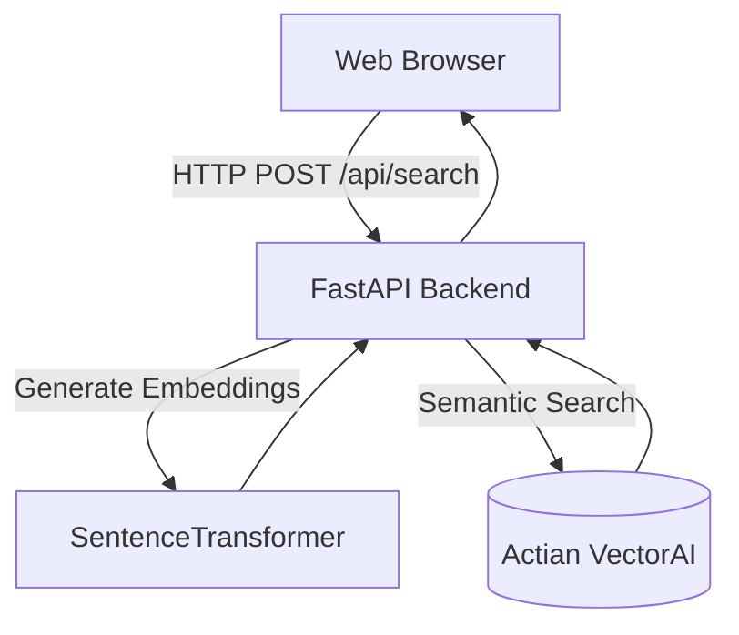

# IntelGraph

IntelGraph is a semantic search engine designed for cybersecurity intelligence. Powered by **Actian VectorAI Database** and **FastAPI**, it allows analysts to search the MITRE ATT&CK knowledge base using natural language rather than relying on exact keyword matches or technique IDs.

For example, a query for *"browser credential theft"* semantically matches techniques like *"Credentials from Web Browsers"* and *"OS Credential Dumping"*.

## Features
- **Semantic Search**: Powered by Actian VectorAI and the `all-MiniLM-L6-v2` embedding model.
- **MITRE ATT&CK Ingestion**: Automated pipeline to download, parse, and embed the Enterprise ATT&CK STIX dataset.
- **Metadata Filtering**: Dynamically filter techniques by **Platform** (e.g., Windows, Linux, macOS) or **Tactic** (e.g., Credential Access, Defense Evasion).
- **Related Techniques**: Instantly discover structurally and semantically related techniques for any given threat.
- **Modern UI**: Clean, responsive, glassmorphic UI built with Vanilla JavaScript, HTML, and CSS. No bloated frontend frameworks.

## Architecture



## Tech Stack
- **Backend**: Python 3.11, FastAPI, Uvicorn, Pydantic
- **Vector Database**: Actian VectorAI Client
- **Embeddings**: SentenceTransformers (`all-MiniLM-L6-v2`)
- **Frontend**: HTML5, CSS3, Vanilla JavaScript

## Project Structure

```text
IntelGraph/
├── backend/
│   ├── api.py                  # FastAPI application and routing
│   ├── constants.py            # Global configuration
│   ├── create_collection.py    # Admin utility to init VectorAI collection
│   ├── embed.py                # Singleton for embedding generation
│   ├── ingest/                 # MITRE ATT&CK dataset ingestion pipeline
│   ├── models/                 # Pydantic schemas (Request/Response)
│   ├── routes/                 # API endpoint definitions
│   └── services/               # Core business logic and VectorAI queries
├── frontend/                   # Static assets (HTML, CSS, JS)
├── data/                       # Cached metadata and downloaded STIX files
├── .env.example
├── requirements.txt
└── docker-compose.yml          # Actian VectorAI database configuration
```

## Installation & Setup

### 1. Requirements
- Docker & Docker Compose (for the VectorAI Database)
- Python 3.10+

### 2. Start Actian VectorAI
IntelGraph requires a running instance of Actian VectorAI.
```bash
docker-compose up -d
```

### 3. Setup Python Environment
```bash
python -m venv .venv
# Windows
.venv\Scripts\activate
# Linux/Mac
source .venv/bin/activate

pip install -r requirements.txt
```
*(Optional: Copy `.env.example` to `.env` to override `VECTORAI_HOST` if you aren't using the default port).*

### 4. Ingest Data
Populate the persistent VectorAI database with the MITRE ATT&CK dataset.
```bash
cd backend
python -m ingest.mitre_attack
```
*The API creates the collection automatically at startup and keeps one VectorAI connection open for its lifetime. The Docker volume retains the collection and vectors across container restarts. The ingestion script will download the dataset and embed all techniques, which may take a minute depending on your hardware.*

### 5. Run the Backend
```bash
cd backend
uvicorn api:app --reload
```
The application and frontend UI will now be available at `http://localhost:8000/`.

## Screenshots
*(Insert Screenshots Here)*

## Future Roadmap
- Ingest Sigma Rules, CVEs, and CAPEC.
- Add advanced conversational / RAG capabilities on top of search results.
- Implement user authentication and custom watchlist features.

## Acknowledgements
Built for the Actian VectorAI Track. 

## License
MIT License
